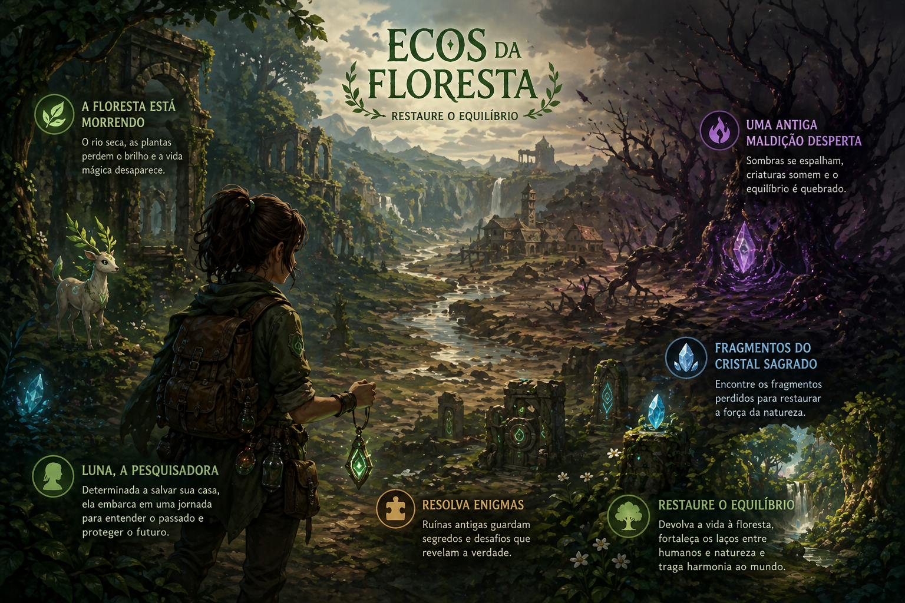
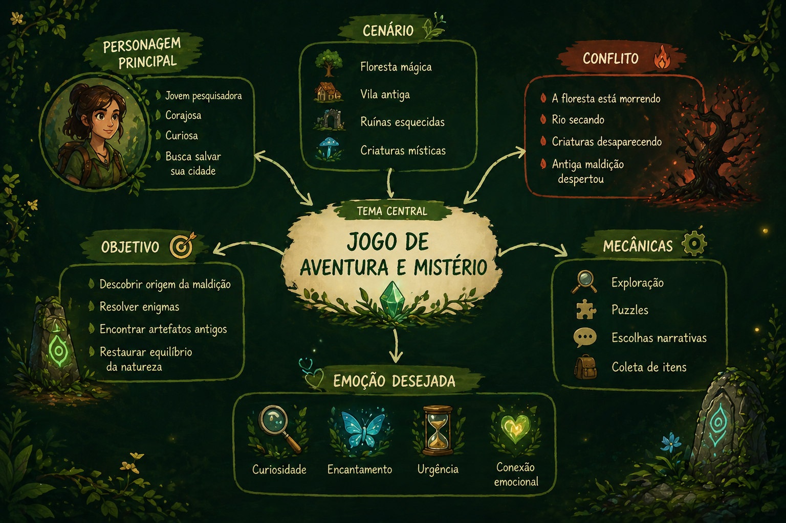

# 🌿 Ecos da Floresta

> Uma aventura sobre equilíbrio, escolhas e conexão com a natureza.

  

## 🎮 Sobre o projeto

**Ecos da Floresta** é um projeto conceitual de game design desenvolvido durante meus estudos em desenvolvimento de jogos.

A proposta foi criar e refinar a ideia de um jogo, explorando narrativa, estrutura, mecânicas e a experiência que se deseja proporcionar ao jogador.

O projeto encontra-se atualmente em sua fase conceitual e ainda não possui uma versão jogável.

---

## 🌲 Sobre o jogo

**Gênero:** Aventura e mistério

Luna, uma jovem pesquisadora, retorna à sua cidade natal ao perceber que a floresta está morrendo e que o rio principal começa a secar.

Criaturas mágicas desaparecem e uma antiga maldição desperta.

Para descobrir o que aconteceu, Luna precisa explorar a floresta, encontrar os fragmentos perdidos de um cristal sagrado, resolver enigmas e restaurar o equilíbrio entre humanos e natureza.

### Principais elementos

- 🌲 Exploração de uma floresta mágica
- 🧩 Puzzles e enigmas
- 💎 Busca por artefatos perdidos
- ✨ Criaturas místicas
- 🔥 Uma antiga maldição
- 🎒 Coleta de itens
- 💬 Escolhas narrativas
- 🌱 Restauração da natureza

---

## 🧠 Processo de criação

Para desenvolver e aprofundar o conceito do jogo, utilizei duas técnicas de ideação: **Mapa Mental** e **5 Porquês**.

### Mapa Mental

O mapa mental ajudou a organizar os elementos centrais da experiência, conectando personagem, cenário, conflito, objetivos, mecânicas e as emoções que o jogo pretende provocar.

  

### 5 Porquês

A técnica dos **5 Porquês** foi utilizada para aprofundar o conflito central da narrativa.

A investigação partiu de uma pergunta simples:

> **Por que a floresta está morrendo?**

A partir dela, o problema foi aprofundado até chegar à exploração do poder de um cristal sagrado e à perda da conexão entre seres humanos e natureza.

Esse processo ajudou a transformar o conflito inicial em uma narrativa com propósito e significado ambiental.

---

## 📖 Estrutura narrativa

A narrativa foi estruturada utilizando a **Jornada do Herói**, acompanhando a transformação da protagonista ao longo da experiência:

1. Chamado para a aventura
2. Descoberta do problema
3. Desafios e provações
4. Transformação da protagonista
5. Restauração do equilíbrio

A intenção é permitir que o jogador acompanhe a evolução de Luna enquanto descobre os mistérios da floresta e compreende as consequências do conflito.

---

## ✨ Experiência do jogador

O conceito foi pensado para despertar:

- curiosidade;
- encantamento;
- urgência;
- descoberta;
- conexão emocional;
- senso de missão.

Narrativa, exploração e puzzles trabalham em conjunto para aproximar o jogador da jornada de Luna e do processo de restauração da floresta.

---

## 🚧 Status

**Game Concept**

Atualmente, o projeto contempla:

- conceito e proposta do jogo;
- narrativa e protagonista;
- cenário e conflito;
- mecânicas propostas;
- estrutura narrativa;
- experiência desejada para o jogador.

> Este repositório apresenta o processo conceitual do projeto.  
> Ainda não existe uma versão jogável.

---

## 🔮 Próximos passos

Pretendo continuar desenvolvendo **Ecos da Floresta** como projeto de estudo e transformar o conceito em um pequeno protótipo jogável.

Entre os próximos experimentos estão:

- movimentação da personagem;
- interação com o cenário;
- coleta dos fragmentos do cristal;
- implementação de puzzles;
- animações 2D;
- gerenciamento do estado do jogo;
- adaptação para diferentes tamanhos de tela;
- estados de vitória e reinício.

Também pretendo utilizar essa evolução para aprofundar meus estudos em **TypeScript, React e PixiJS**, explorando desenvolvimento frontend aplicado a experiências interativas.

---

## 🎓 Contexto

O conceito inicial de **Ecos da Floresta** foi desenvolvido durante minha participação na **Imersão em Games da SoulCode**, em uma atividade voltada à criação e estruturação da ideia de um jogo.

Embora eu não tenha concluído a imersão, mantive acesso aos materiais e continuo estudando os conteúdos de forma independente.

Retomar este projeto faz parte desse processo de aprendizado e aprofundamento em desenvolvimento de jogos.

---

## 📄 Apresentação do projeto

A apresentação original com o processo de criação e desenvolvimento do conceito está disponível neste repositório:

➡️ [Ver apresentação — Ecos da Floresta](docs/ecos-da-floresta-game-concept.pdf)

---

## 👩‍💻 Autora

**Talytta Fernanda Carvalho**

Desenvolvedora de software com experiência em desenvolvimento web e interesse em frontend, experiências interativas e game development.

[LinkedIn](https://www.linkedin.com/in/talytta-carvalho/) • [GitHub](https://github.com/talyttacarvalho)